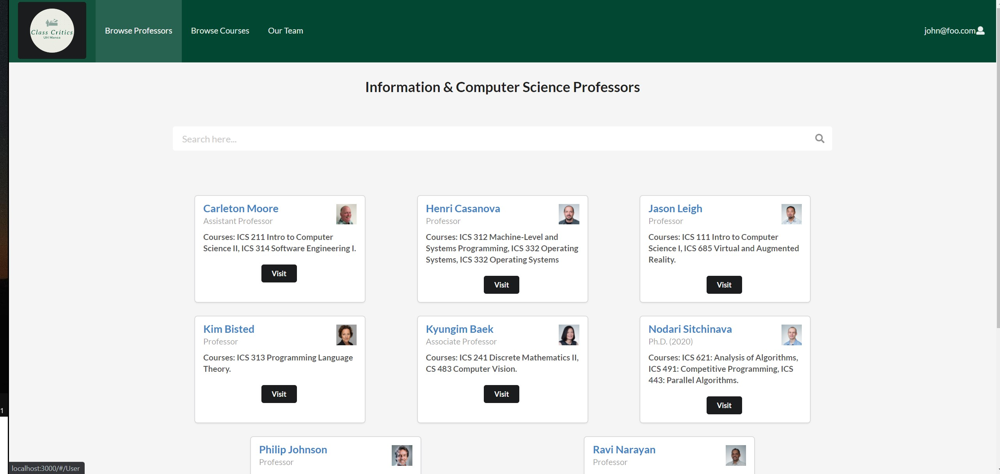
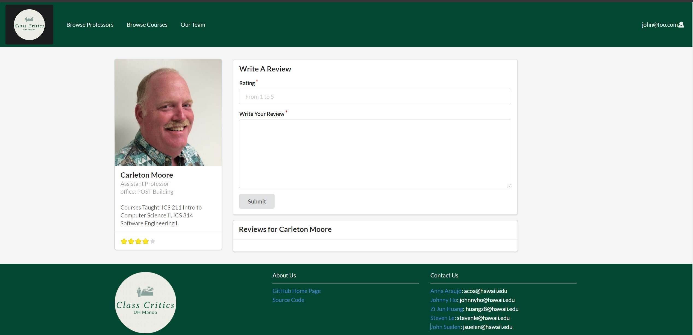
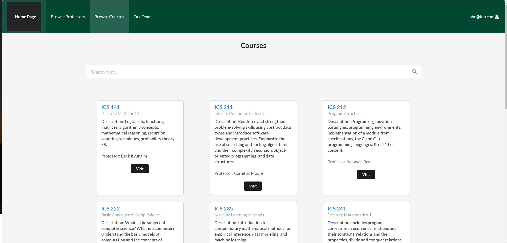

The UH class Critics Website is a website that allows students from the University of Hawaii at Manoa to share their experiences taking different courses and professors at UH. They will be allowed to write reviews and rate instructors from the campus similar to RateMyProfessor. Students can rate the professor and course on a rating scale of 1-5. The student can also write their review on the professor and course. Our website composes of the homepage, login page, logout page, browse professor page, browse rate professor page, rate course page, and our team page that displays the information of the team member who worked on the projects.

I coded the beta version of the page that lets students rate the professor and courses. I also coded the default data that show all the professors on the browse professor Page. One of the important skills I’ve learned from the project is how to communicate with a team member as a developer. It was important for me to communicate with my team what needs to be worked on, and the issues I’m having with the code. Another important skill I learned is to divide the project into different milestones and divide the work among the group. That helped our team to set goals that need to be finished by this milestone, so we can move on to the next piece of the puzzle as a group. Communication within a team and Agile Project management is two skill set I can take my future career, I’m glad I got to learn these skills through this project.

Link to the source code: https://github.com/uh-class-critics/uh-class-critics.github.io
