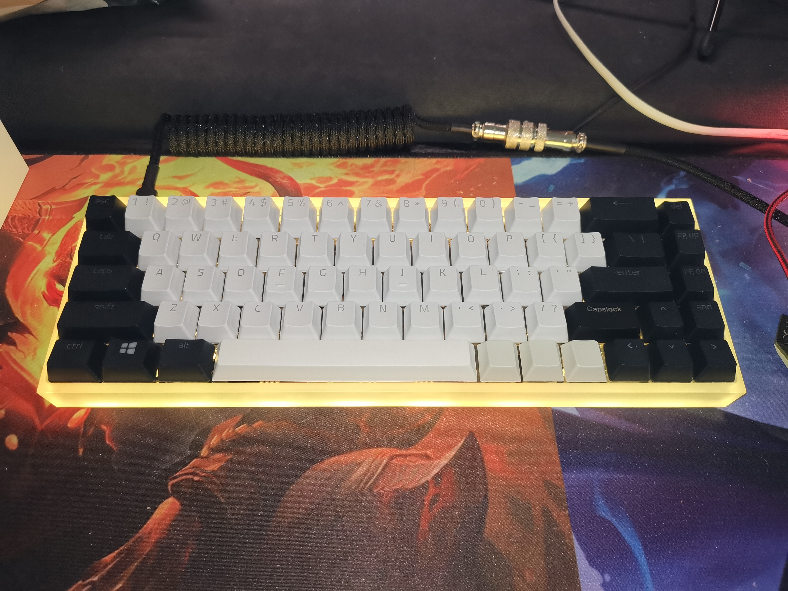
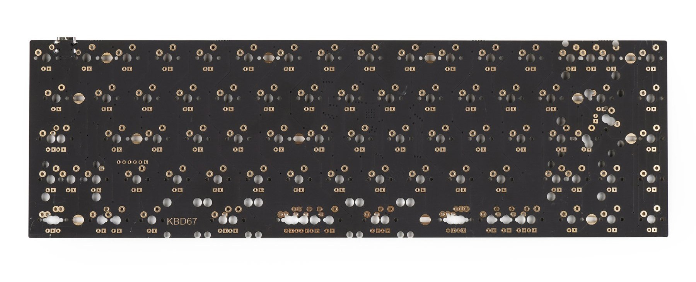
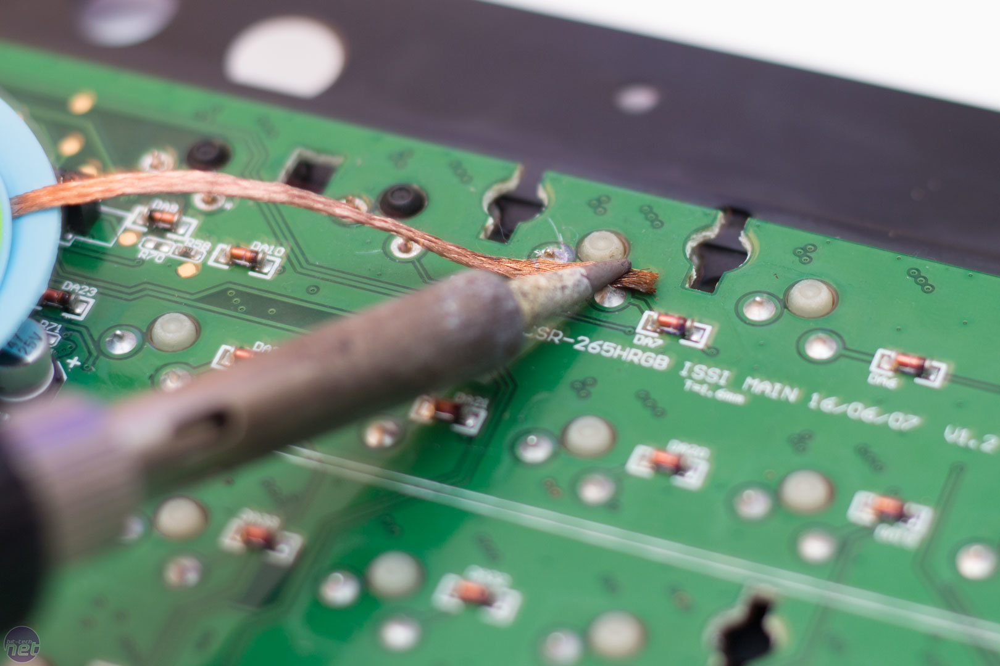
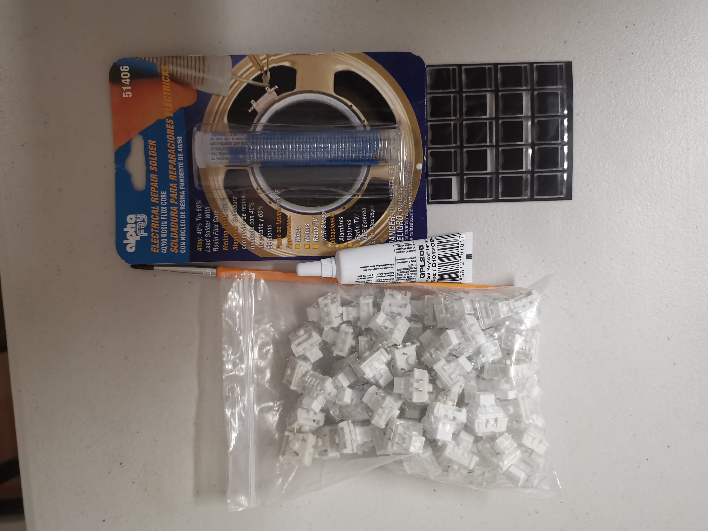

  
  
  
  

Mechanical Keyboard is a project where I bought each individual keyboards parts and assembled the entire board on my own. My mechanical keyboard has the same feature as other keyboard sold in retail store. However, I customize my board from keyboard switches, plate, foam, films, keycaps and the firmware file. 

 To build my own keyboard, I've researched into all the material I need in order to build the board by reading blogs and watching tutorial videos online. The process of building my keyboard started with applying keyboard lubricant to keyboard switch "stem", "feet" and the "housing". This reduces the rattle sound and improves the smoothness of the switches. I rewrote the firmware file basing off the open source file that was published online. One of the problems I encountered was trouble compiling the firmware code, which was resolved after rereading the entire code and making changes to my mistakes. I flashed the firmware into the keyboard's PCB(Printed circuit board) using QMK software. The flashing process enables communications between the keyboard switches and the PCB. Other steps assembling the board included soldering electrical solder with the switch on the PCB, install screws with the PCB and plate on to the keyboard case, and assembling keycaps on to the switches. 

Skills I practiced when building my own custom mechanical keyboard is patience, perseverance and being precise. I've encountered the thought of giving up when my firmware file wouldn't compile, I was very frustrated but thought about how nice it will be when I type on a keyboard that I assembled all the parts myself. That thought allowed me to reanalyze my code and fix the mistake in the code. The soldering process was time consuming and require me to be very precise soldering keyboard switches on the PCB. I have to be very cautious to not point the soldering on the PCB while trying to apply the solder that connects the keyboard switches with the PCB. I was satisfied building my own mechanical keyboard by assembling all the parts, rather than buying a prebuilt keyboard from a store. 

